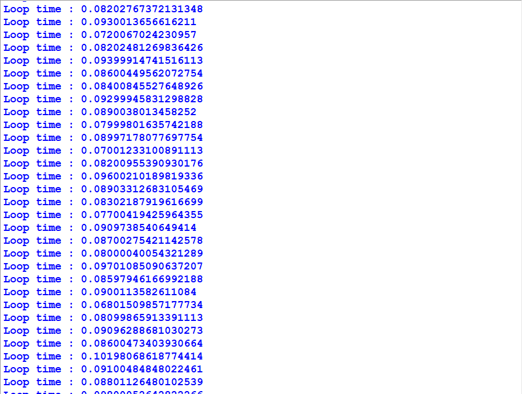
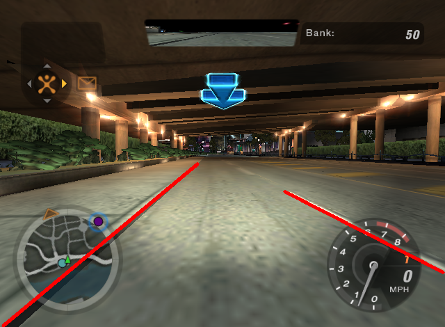
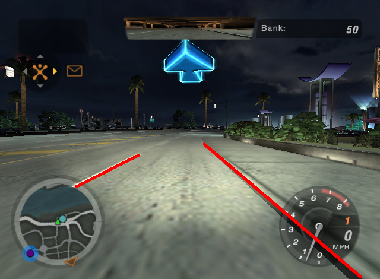
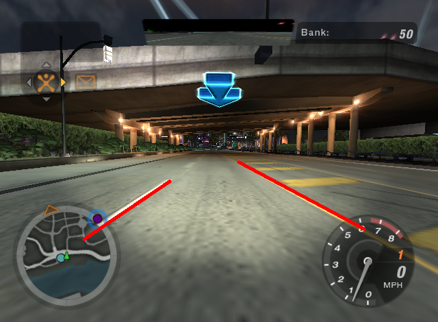
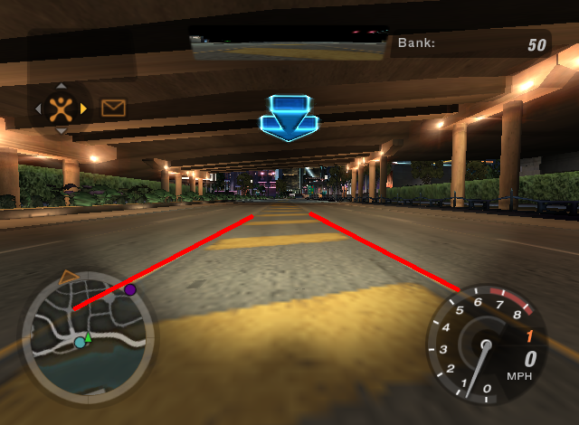
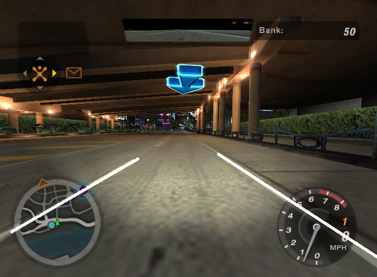
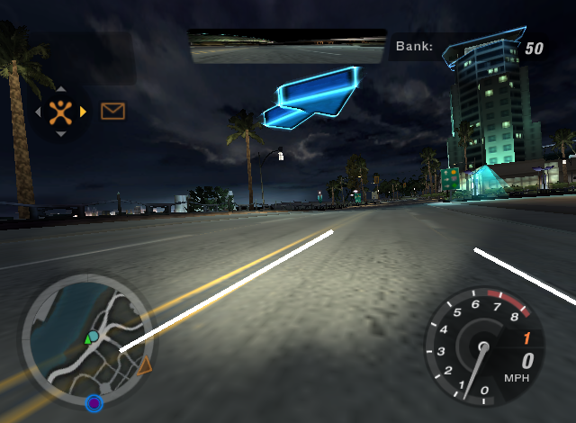
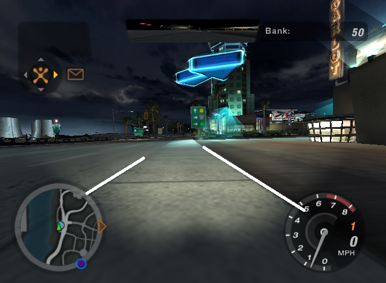
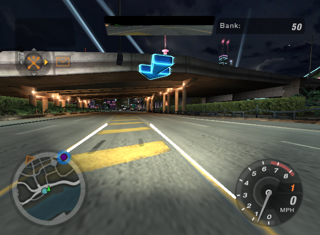

# Detecting Lanes in NFS Underground 2

This project aims to detect lanes in one of the popular racing games, __NFS Underground 2__. For this, I used various image precessing techniques to detect lanes frame by frame from the image stream captured from the game. All the processing is done in real time, i.e. the lanes are detected simultaneously as the game is played.

## Processing

The captured frames from the game are [almost] processed in real time, i.e. the lanes are detected and shown in a separate window at the same time as the game is played. I was able to process about 12 to 13 frames per second with a 5th Gen i3 processor and 8Gb RAM. The average time taken for processing each frame was around 0.08 sec. OpenCV was used used for all image processing tasks.

  

## Results
Some results are shown below :

  
  

  
  

  
  

  
  

## From Ideas to Code

The original plan was to somehow drive the car in this game, but due to inconsistent lane markings and never ending night this is what I ended up with.
